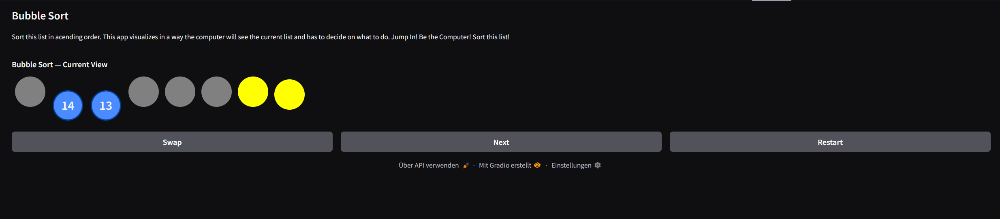
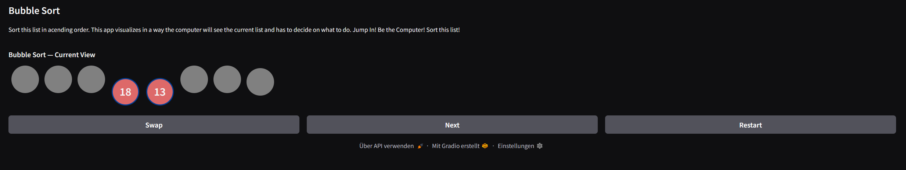
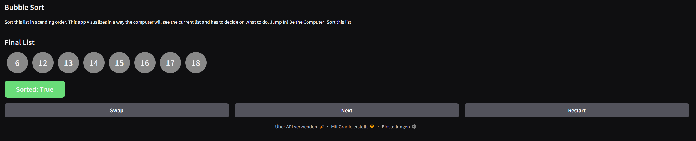

Check out the configuration reference at https://huggingface.co/docs/hub/spaces-config-reference

## Final Project
# Display of Bubble Sort

I choose Bubble Sort but with a twist. The user will only see what the computer can currently see. That is to help understand
that the algorithms has to run until they did not have to swap for a whole loop. The user will have grayed out circles as
representation of the list length. And they can see the two currently selected items.

## Computational Thinking

- Decomposition:
    1. show representation of the list as greyed out circles
    2. show the currently selected items as their actual value
    3. let the user decide to swap or not

- Pattern Recognition:
    - it will just compare and/ or swap neighbouring values

- Abstraction:
    - the user will only see as the computer currently does removing the ability to obviously see if the
      list is sorted

- Algorithm Design:
    - input is pressing buttons and the output is visual representations of the current state

## Images

## Testing
I tested lots of times and made a lot of adjustments. The yellow circles I had not planned from the beginnig but they add a lot to the understanding.
Also I added that you have to swap if the algorithm would do it. The way the random list is created it is not possible to have duplicate values even
though that would still work. I tested the false swapping and the reset button and nothing broke. 

## Links
https://huggingface.co/spaces/SwedJul/CISC121

## Author
Julian Letsche
Student ID: 20564192
[AI Disclaimer]: I used ChatGPT to help with the visualization because I don't know HTML language